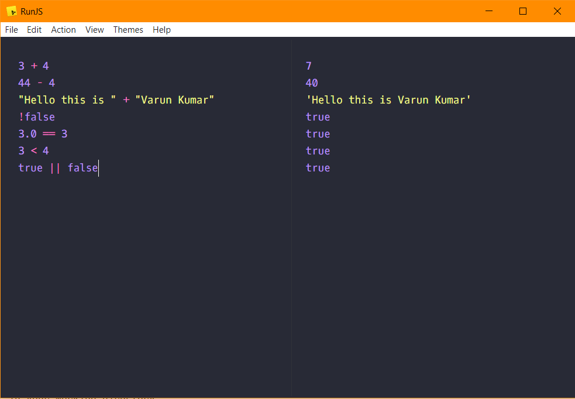

## Arithmetic Operations :-
    3 + 4
    44 - 4

## String Operation :-
    "Hello this is " + "Varun Kumar"

## Urinary Operation :-
    !false -> the '!' mark.

## Comparision Operation :-
    3.0 == 3 -> the '==' operator.

## Less-Then Operation :-
    3 < 4 -> the '<' operator.

## OR Operation :-
    true || false -> the '||' symbol.

##

Here is a screenshot of the operations above
 

