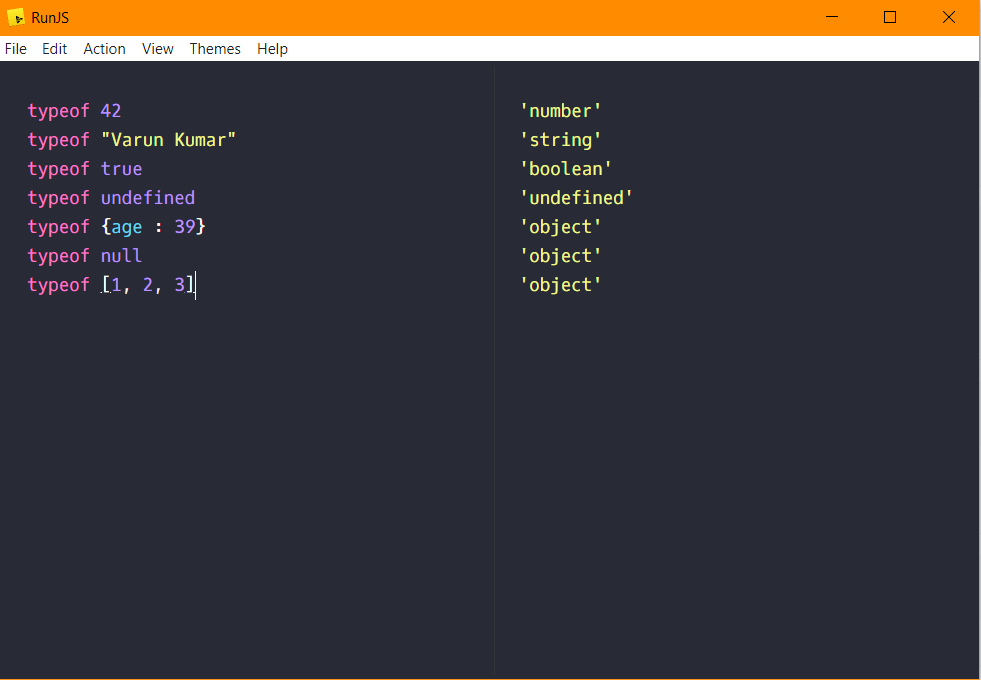

## typeof 42 :-
    number

## typeof "Varun Kumar":-
    string

## typeof true :-
    boolean

## typeof undefined :-
    undefined

## typeof {age : 39} :-
    object

## typeof null :-
    object
    
## typeof [1, 2, 3] :-
    object

##

Here is a screenshot of the operations above
 

## Important Links :-

[MDN `typeof`](https://developer.mozilla.org/en-US/docs/Web/JavaScript/Reference/Operators/typeof)
