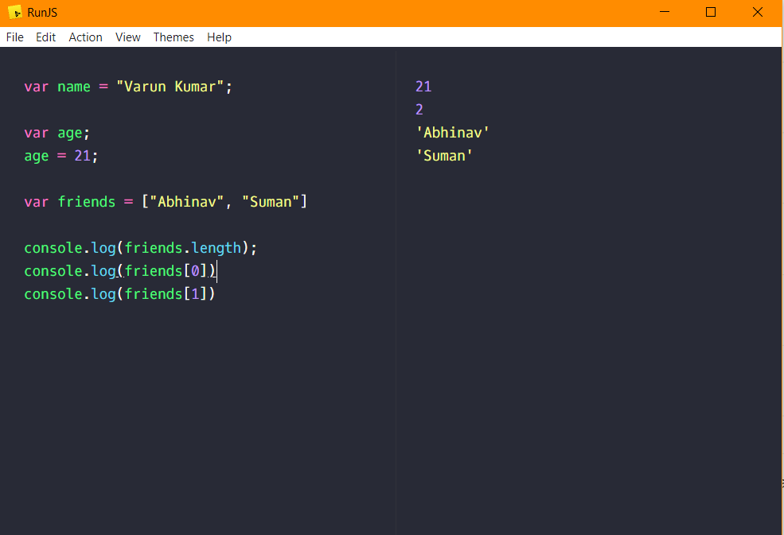

## Variable in JavaScript :-

    variable in JavaScript starts with "var" keyword.

## 'var' Syntax :-

    var {variable_name};
            
            or
            
     var {variable_name} = {value};

## var :-

    var name = "Varun Kumar";
    var age;
    age = 21;
    
    var friends = ["Abhinav", "Suman"];

## Printing Variable Syntax :-
    console.log({variable_name});

## Printing Variable :-
    console.log(friends[0])
    console.log(friends[1])

## Length of Variable :-
    console.log(friends.length);

##

Here is a screenshot of the operations above
 

