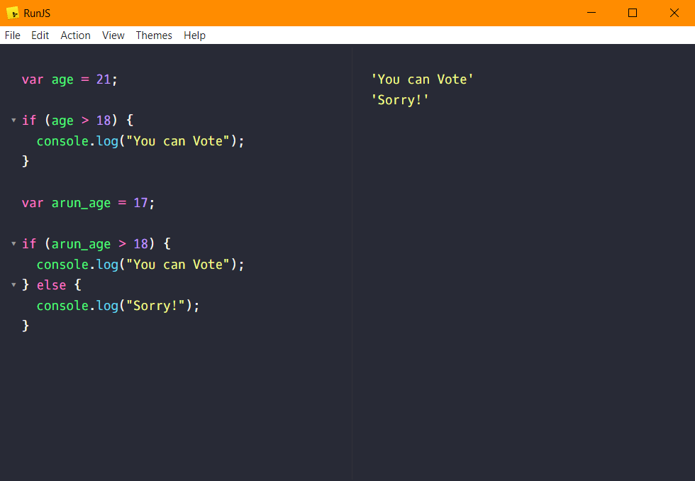

# If & Else
`If & Else` is used for making decision in `JavaScript`.

### Example of If Statement
    var age = 21;
    
    if (age > 18) {
        console.log("You can Vote");
     }

### Example of If...Else Statement
    var age = 21;
    
    if (age > 18) {
        console.log("You can Vote");
     } else {
        console.log("Sorry!");
     }

#

Here is a screenshot of the operations above
 

