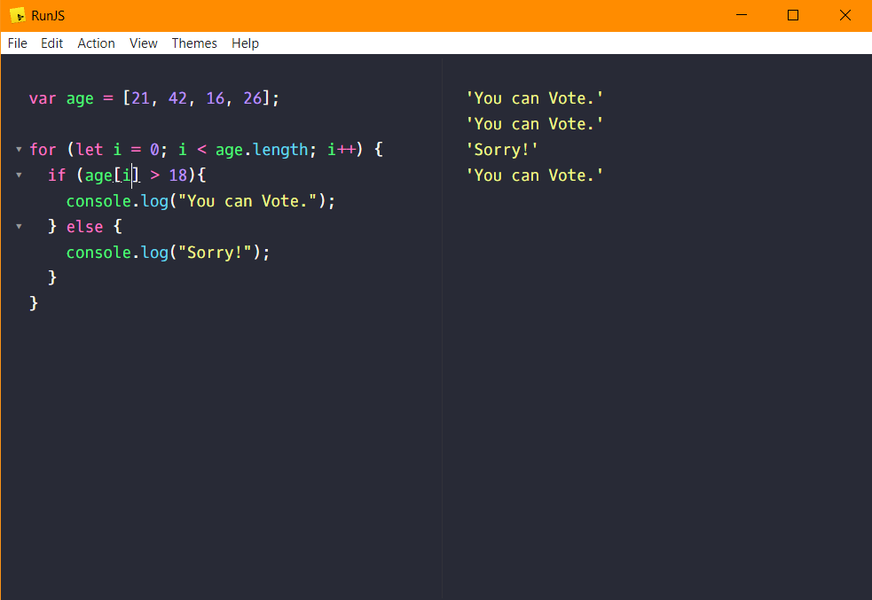
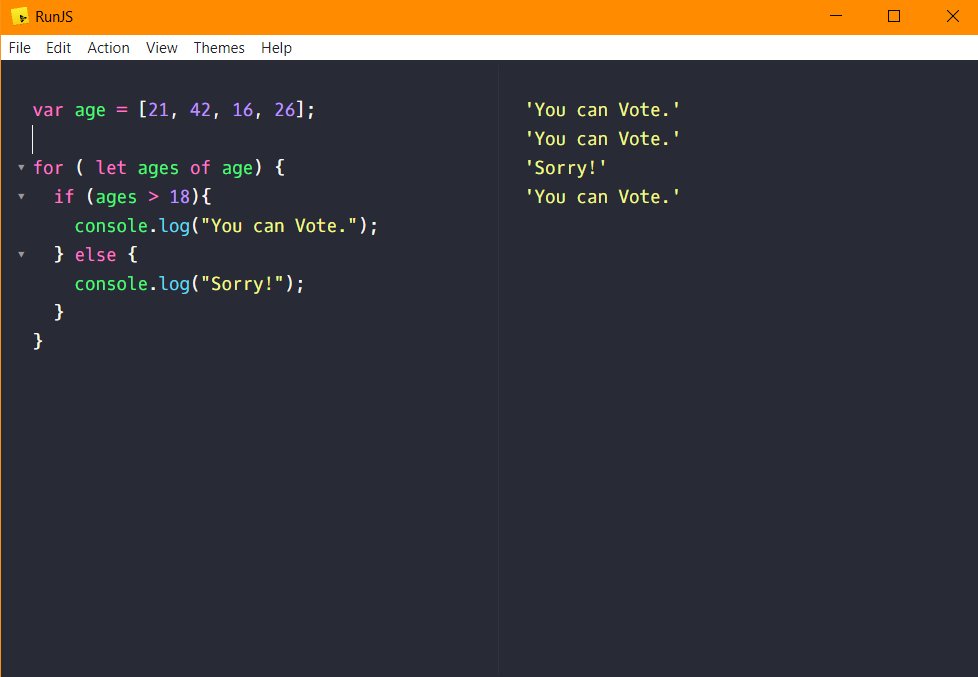
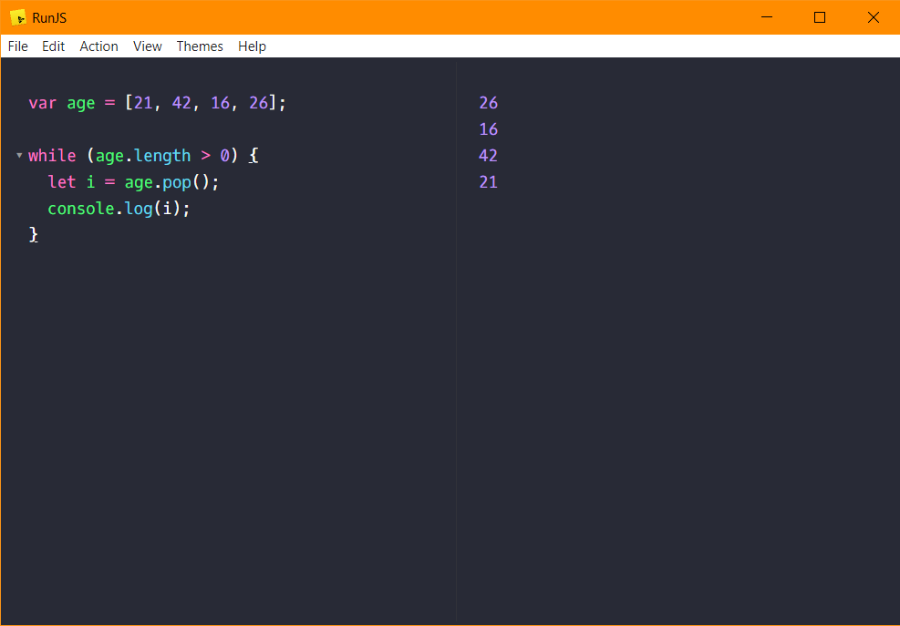

# Loops 
`Loops` in `JavaScript` is used to control **"how many times an operation had to be done"**.

## Types of Loops :
    for loop
    while loop
    
    
### `for` Loops Example :-

    var age = [21, 42, 16, 26];
    
    for (let i = 0; i < age.length; i++) {
      if (age[i] > 18){
        console.log("You can Vote.");
      } else {
        console.log("Sorry!");
      }
    }

#

Here is a screenshot of the **`for loop`** above :- 
 

#

Here is a screenshot of the another type of **`for loop`** :- 
 

### `while` Loops Example :-
    
    var age = [21, 42, 16, 26];
    
    while (age.length > 0) {
      let i = age.pop();
      console.log(i);
    }

#

Here is a screenshot of the another type of **`for loop`** :- 
 

