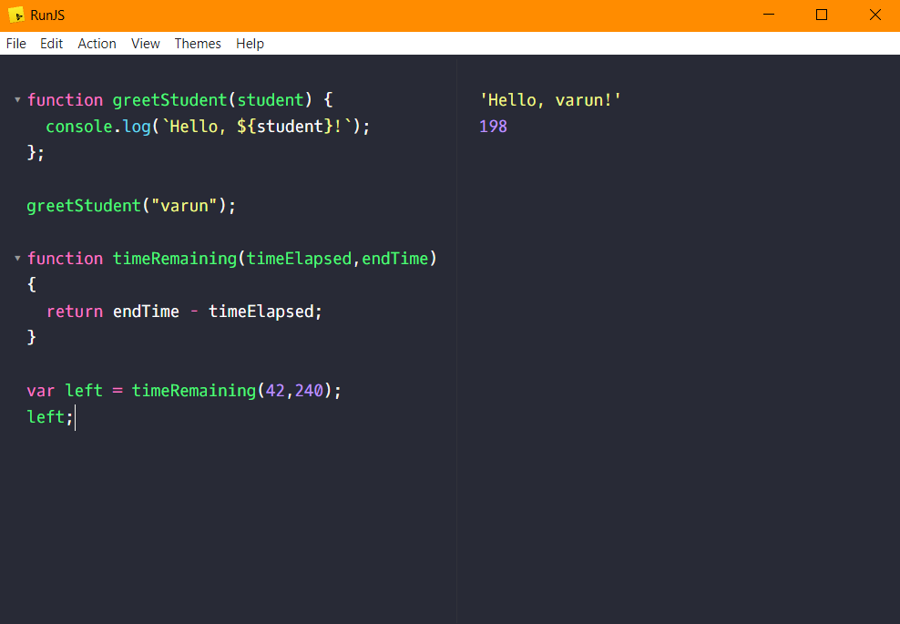

# `function` in JavaScript

Function in JavaScript is used to define a repeated set of task.

### Example :
    function greetStudent(student) {
      console.log(`Hello, ${student}!`);
    };
    
    greetStudent("varun");  // 'Hello, varun!'

######
    function timeRemaining(timeElapsed,endTime){
          return endTime - timeElapsed;
        }
        
        var left = timeRemaining(42,240);
        left;    // 198

#

Here is a screenshot of the **`function`** executed above :- 
 

