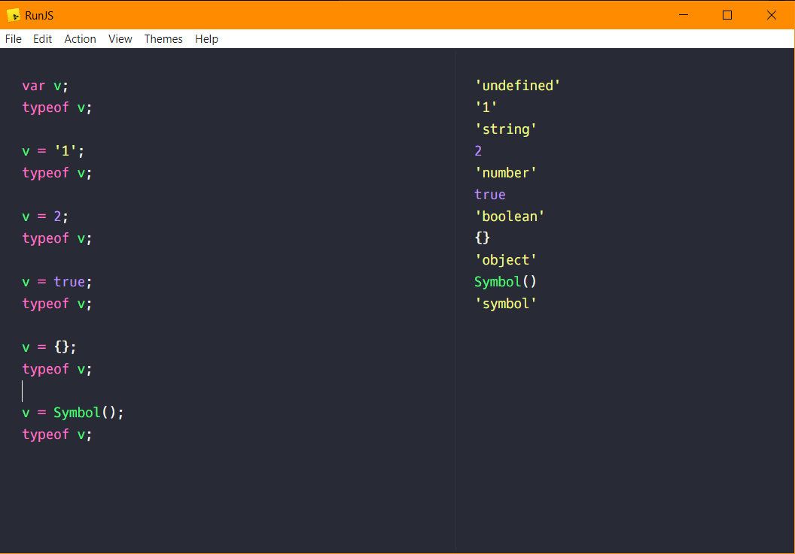
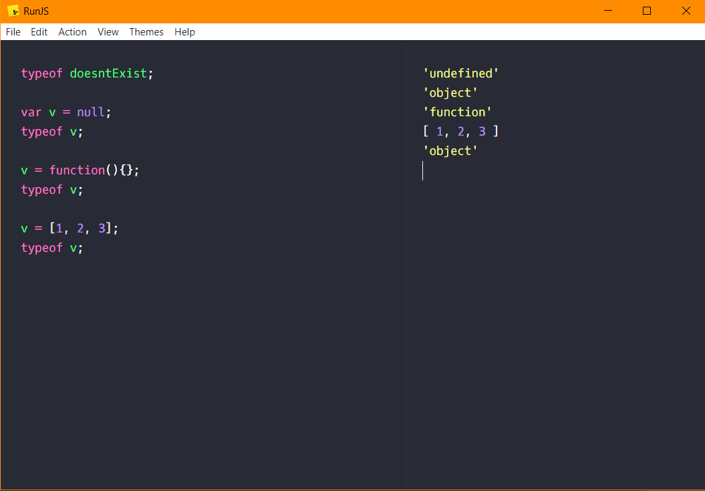

# Primitive Type in JavaScript :- 
    undefined
    string
    number
    boolean
    object
    symbol
    
    null?
    function?
    array?
    
**In JavaScript variables don't have types, values do.**

# 

# 

