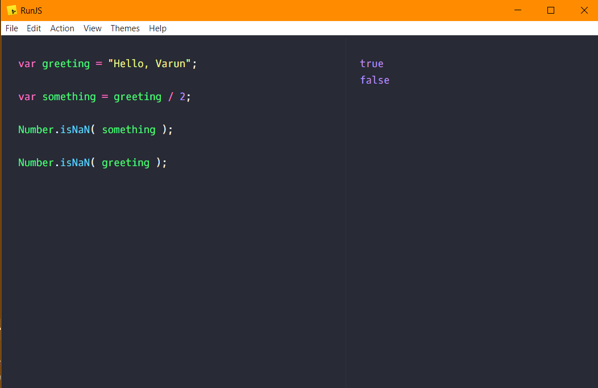

# `NaN` in JavaScript

`NaN` or `Not a Number` in JavaScript, is an **error**, which occurs when we try to do arithmetic 
operation between something **non-numerical** and **numerical**.

### Example
    var greeting = "Hello, Varun";
    
    var something = greeting / 2;
    
    Number.isNaN( something ); // true
    
    Number.isNaN( greeting ); // false
    
    
    var tryIt = greeting.length / 2;
    Number.isNan( tryIt ); //false
    
    
# 

